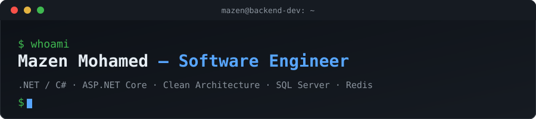

 

---

## 👨‍💻 About Me

I’m a **Software Engineering student** (3rd year, GPA 3.7/4.0) at Helwan University, with a strong passion for building robust, scalable, and maintainable backend systems. My engineering approach is rooted in:

- **Object-Oriented Programming & Design Patterns** – writing clean, reusable, and testable code.
- **Data Structures & Algorithms** – solving complex problems efficiently (611+ on Codeforces, 100+ on LeetCode).
- **Clean Architecture & SOLID** – structuring applications for long‑term maintainability and adaptability.
- **Distributed Systems** – designing high‑performance architectures with caching, asynchronous processing, and real‑time communication.
- **Automated Testing** – ensuring reliability through xUnit, Moq, and integration tests.

I currently focus on **enterprise multi‑vendor backends**, **high‑performance caching**, and **cloud‑ready deployment** with Docker. I’m open to backend engineering roles, internships, and freelance projects—especially where I can apply my .NET expertise and architectural mindset.

---

## 🚀 Featured Engineering Projects

### 🏪 [VendorHub](https://github.com/MazenMohamedali/VendorHub) – Enterprise Multi‑Vendor E‑Commerce Platform

> A production‑grade backend built with **Clean Architecture**, **SOLID**, and **Domain‑Driven Design** – demonstrating scalable system design and high‑performance patterns.

- **Caching Strategy** – Two‑tier L1/L2 caching (`IMemoryCache` + Redis) with event‑driven invalidation; reduced read latency from **372 ms to ~1.88 ms** (200× faster).
- **Real‑Time Features** – SignalR for live order updates and admin dashboards, secured with claims‑based authorization.
- **Asynchronous Processing** – Offloaded notifications to background channel queues, keeping HTTP responses snappy.
- **Defensive Design** – Global exception handling (RFC 7807 `ProblemDetails`), optimistic concurrency, and WebP magic‑byte validation for secure image uploads.
- **Containerized** – Full Docker Compose setup for easy deployment.

  
  
  
  
  
  

 

### 🔄 [Smart File Sync](https://github.com/MazenMohamedali/SmartFileSync) – Multi‑Threaded Sync & Backup Engine

> An extensible console utility for scheduled and real‑time directory synchronization, showcasing concurrency and modular design.

- **Concurrency** – Uses Async/TAP and producer‑consumer patterns for high‑throughput I/O.
- **Pluggable Architecture** – Interface‑driven design supports multiple storage targets (FTP, Database, Local).
- **Graceful Handling** – Cancellation, progress logging, and error recovery.

  
  

---

## 🧰 Engineering Stack

### 💻 Languages & Web

### ⚙️ Backend & Frameworks

### 🗄️ Databases & Caching

### 🚀 DevOps & Tools

### 🧪 Testing & Quality

---

## 📈 Competitive Programming & Certifications

- **600+** problems solved on **Codeforces**; **100+** on **LeetCode**.
- **HackerRank** – SQL (Basic, Intermediate, Advanced) certified.
- **LeetCode** – SQL 50 badge & 50 Days Badge 2025.

---

## 🐍 Contribution Graph

  

---

  ⚡ "Engineering systems that scale, code that endures, and architectures that evolve."

